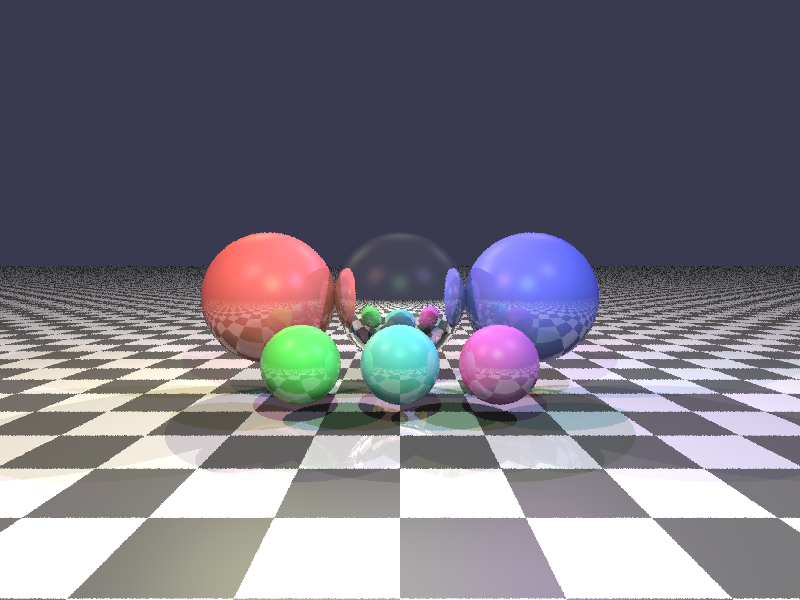

# Python Raytracer

A simple raytracer implementation in Python that renders 3D scenes with multiple colorful light sources.

## Features

- Basic raytracing with reflections
- Multiple colored light sources
- Various primitive objects (spheres, planes)
- Materials with different properties
- Shadows and reflections
- Anti-aliasing via supersampling
- Checkered floor pattern

## Sample Render



The default scene includes:
- A checkered floor
- Several spheres with different materials and colors
- Multiple colorful light sources that illuminate the scene

## Requirements

- Python 3.6 or higher
- NumPy
- Pillow (PIL)

## Installation

1. Clone this repository:
```bash
git clone https://github.com/BurnyCoder/ray-tracer.git
cd ray-tracer
```

2. Install the required dependencies:
```bash
pip install -r requirements.txt
```

## Usage

Run the raytracer with:

```bash
python raytracer.py
```

The script will render the scene and save it as `raytraced_scene.png` in the current directory. The rendering progress will be displayed in the console.

## How It Works

The raytracer implements:
- Vector mathematics for 3D operations
- Ray-object intersection algorithms
- Phong lighting model (ambient, diffuse, specular)
- Reflection calculations
- Shadow ray calculations
- Camera model with perspective projection

## Customizing

You can customize the scene by modifying the `create_test_scene()` function in the `raytracer.py` file. You can:

- Add or remove objects
- Change object materials and properties
- Adjust light positions and colors
- Modify the camera position and settings

## Performance

The rendering time depends on the image resolution, number of samples for anti-aliasing, and maximum recursion depth for reflections. These parameters can be adjusted in the `main()` function.

## License

MIT License 